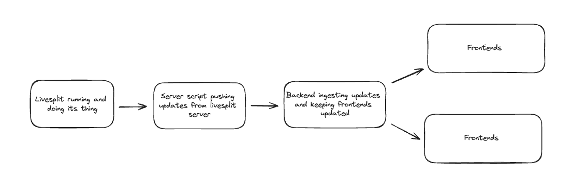

# LSSC (LiveSplit Slide Changer)

This project will sync a livesplit timer to a website containing an image. This image will change every split so that you can keep relevant notes automatically on your computer / second monitor while speedrunning.

## Features

- Present a picture in a graphical way
- Change picture depending on the relevant split
- Be online so that multiple people can view the images. (although the website will only sync to one livesplit timer)
- Websockets + astro for visual interface and syncing with the livesplit timer.
- Show other relevant information such as splits to the webpage.

## Architechture

